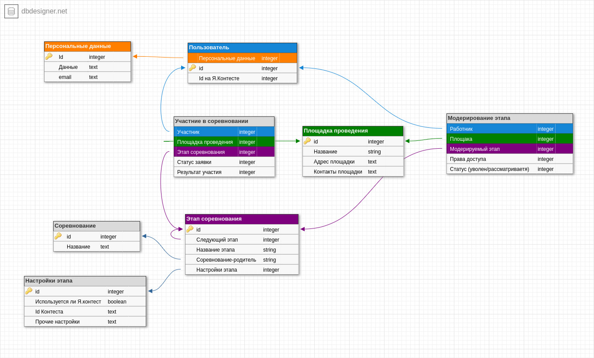

# Distributed Events

### Команда разработчиков

- Павел Шувалов - ментор
- Алексей Скворцов - Fronted/Backend developer & TeamLead
- Даниэль Сахаров - Backend & Reviewer
- Иван Комаров - DataBase/Backend developer 
- Михаил Нарижный - Backend developer

### Ранее над проектом работали
- Мария Малых - Project Manajer
- Андрей Жогов - Backend developer
- Дарья Липатова - Fullstack developer
- Владимир Никитин - Backend developer
- Владислав Шубин - Backend developer
- Андрей Шинкареко - Frontend developer & Team Leader

### Инструкция по запуску проекта:
- Используйте python 3.10 и выше
- Откройте терминал
- Выполнить `git clone https://github.com/hsse-distributed-events-team/distributed-events.git`
- Выполнить `cd distributed-events`
- Откройте проект в среде разработки PyCharm
- После откротия будет предложено создать виртуальную среду, используя **requirements.txt**, нажимайте ок
- Откройте встроенный терминал
- Выполните `git checkout develop`
- Выполните `python3 main.py` Выполнить миграции? Y/N Y
- Приложение доступно к использованию по адресу http://127.0.0.1:8000/
- Наслаждайтесь!
### Инструкция для запуска документации к проекту:
- Откройте встроенный терминал PyCharm
- Выполните `cd docs`
- Выполните `make html`
- Выполните `xdg-open build/html/index.html`
- Откроется страница в вашем браузере по-умолчанию

### Инструкция по использованию репозитория:
- Для выполнения своих подзадач создавайте ветки по образцу **feature/name_of_task**
- После выполнения подзадачи создайте **pull request** и отметьте технического писателя как **reviewer**
  - Запросы на слияние позволяют вам сообщать другим пользователям об изменениях, которые вы отправили в ветку в репозитории. Как только запрос на слияние открыт, вы можете обсудить и просмотреть потенциальные изменения и добавить последующие коммиты, прежде чем ваши изменения будут объединены в базовую ветку.
- Для запуска используйте прямые команды или запустите **main.py**
- Используйте актуальные версии инструментов для этого есть **requirements.txt**
- Настоятельно рекомендую писать коментарии к вашему коду, коментарии должны содержать пояснение к коду, отвечающие на простые вопросы как: что делает ваш метод
- Обязательно пишите сообщения в комитах, поясняющие, что изменилось/добавилось

### Текущая упрощённая схема DB
